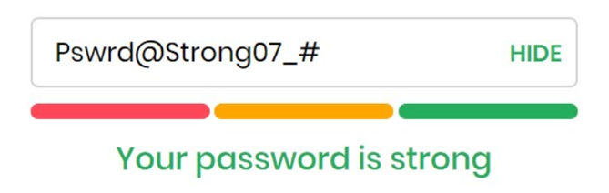
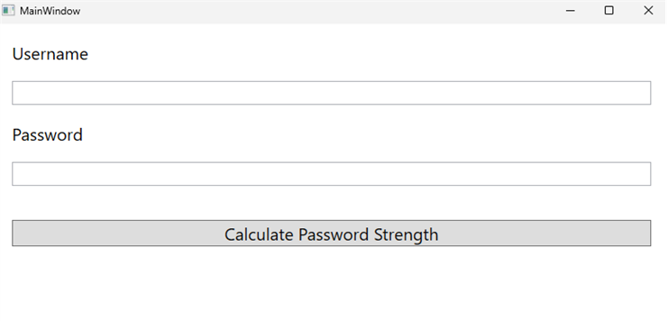

# Labo 4 - Veelgebruikte-klassen: Wachtwoordmeter

We gaan een applicatie maken waarmee we kunnen meten hoe sterk een wachtwoord is.​

## Deel 1
Voor we de tekst gaan evalueren die door de gebruiker is ingegeven gaan we deze opkuisen aan een overdaad van spaties.
- Verwijder eerst extra spaties vooraan en op het einde van de gebruikersnaam en het ingegeven wachtwoord voor je de volgende controles doet.

Meet vervolgens de sterkte van het wachtwoord met de volgende criteria.​
- Controleer of het wachtwoord niet de gebruikersnaam bevat.​
- Controleer of het wachtwoord minstens één getal bevat.​
- Controleer of het wachtwoord minstens tien karakters lang is.​
***Extra:***
	- Controleer of het wachtwoord minstens één hoofdletter bevat.​
	- Controleer of het wachtwoord minstens één kleine letter bevat.

Nadat je de criteria hebt gechecked, toon je het resultaat aan de gebruiker in de resultTextBlock.
- Indien alle criteria gehaald zijn, dan is het wachtwoord sterk. ​
- Indien één criteria niet gehaald is, dan is het wachtwoord ok.​
- Anders, is het wachtwoord slecht.​

***Extra: Pas de kleur aan van de output tekst op basis van de score:​***
- Sterk = groen​
- Ok = oranje​
- Slecht = rood

## Deel 2
Indien een ingegeven wachtwoord slecht is, dan stel je een zelf een willekeurig sterk wachtwoord voor.​ Stel het sterk wachtwoord samen uit de volgende delen met een StringBuilder:​
- Haal 5 willekeurige letters uit de gebruikersnaam en voeg ze toe als kleine letters aan het wachtwoord.​
- Genereer 5 willekeurige cijfers van 0 tot en met 10 en voeg deze toe aan het wachtwoord.​
- Haal 2 willekeurige letters uit de gebruikersnaam en voeg ze toe als hoofdletters aan het wachtwoord.​
- Genereer een getal van één tot vijf en voeg zoveel uitroeptekens toe.​
- *Extra: Vind een manier om volledig willekeurige letters toe te voegen in plaats van de gebruikersnaam te gebruiken.​*
- ***Extra: Vind een manier om met string operaties​ de tekst van het wachtwoord willekeurig door ​elkaar te schuiven​***

## Deel 3
Indien een ingegeven wachtwoord slecht is, dan stel je een zelf een willekeurig sterk wachtwoord voor.​
- Toon het nieuwe wachtwoord met een MessageBox​.
- Vraag met de MessageBox of de gebruiker het nieuwe wachtwoord wil instellen. Als de gebruiker op "Yes" klikt, dan update je het nieuwe wachtwoord in het tekstveld.​

